# 4 Results

## 4.1 Pre-pandemic underground ridership

Stations were grouped by TfL fare zones, which categorise London into concentric rings (Zone 1 in the centre through Zone 9 in the periphery). Pre-pandemic ridership trend was calculated with 2017-2019 data, with all zones converging to the 2019 baseline of 100. As stated previously, TfL’s definition of weekday in 2017 and 2018 included more days than 2019. Therefore, annualised trend showed comparisons of each year with the same definition, while in the weekday commuting ridership, 2017 and 2018 data were more inflated, and 2019 data were deflated.

After the test, Zone 2 was identified as an outlier, with average values significantly higher than other zones in both annualised (@fig-preannual) and weekday plots (@fig-preweekday). To avoid distortion, Zone 2 was excluded from the main figures, while the original plots including Zone 2 are provided in the Appendix.

In both plots, Zones 1 to 6 show only minor fluctuations year to year, indicating broadly consistent demand levels leading up to the pandemic. Outer zones (7 to 9) exhibit greater volatility, with noticeable dips in 2018 followed by recovery in 2019, suggesting more variability in ridership at peripheral stations. The annualised ridership varied between 90% and 103% of 2019 baseline, while weekday ridership varied between 94% and 103%, both suggested relatively stable demand.

::: {#fig-preannual}
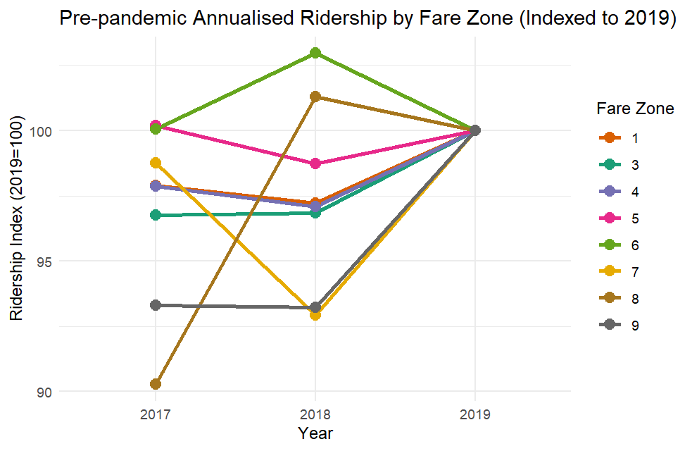

**Pre-pandemic annualised ridership by fare zone, 2017–2019 (indexed to 2019)** Line chart of station-level ridership aggregated to fare zones and normalised to 2019 = 100, using annualised totals to measure pre-pandemic trends across zones. Data source: TfL station entry/exit statistics.
:::

::: {#fig-preweekday}
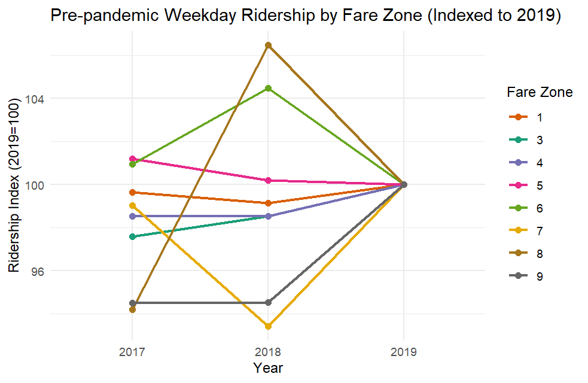

**Pre-pandemic weekday ridership by fare zone, 2017–2019 (indexed to 2019)** Line chart of station-level ridership aggregated to fare zones and normalised to 2019 = 100, using mean Tuesday–Thursday counts to measure weekday commuting patterns before the pandemic. Data source: TfL station entry/exit statistics.
:::

## 4.2 Temporal experiments of recovery rate

### 4.2.1 Median of recovery rate

The trajectory in both figures show a clear progression: 2021 marked by severe disruption, 2022 by partial recovery, and 2023 by near-normalisation of ridership patterns.

@fig-recannualbox shows a sharp decline in 2021 across all fare zones for annualised recovery rates, with median values generally below 0.5, indicating ridership remained less than half of pre-pandemic levels. By 2022, recovery strengthened substantially, with most zones reaching 0.7–0.9 of 2019 levels, though still falling short of full recovery. In 2023, annualised ridership stabilised close to pre-pandemic levels, with interquartile ranges clustered around 0.9–1.0, though central zones (1–2) continued to show slightly lower recovery relative to outer zones.

In @fig-recweekdaybox, weekday recovery rates reveal a similar temporal pattern, but at 0.6 in 2021 and 1.5 of the baseline in 2022 and 2023, which are systematically higher values compared to annualised measures, reflecting stronger commuter demand on working days relative to weekends. Outer zones (particularly 7–9) consistently show higher weekday recovery rates, in some cases exceeding the 2019 baseline.

::: {#fig-recannualbox}
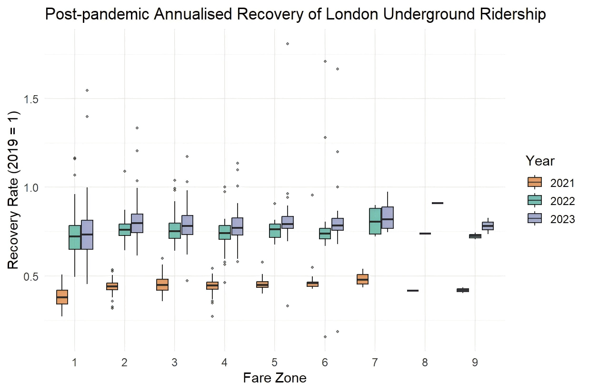

**Post-pandemic annualised recovery of London Underground ridership, 2021–2023** Boxplots show station-level recovery rates (2019 baseline = 1), grouped by fare zone. Recovery rate calculated as total annualised entries/exits in each year divided by 2019 levels, to illustrate how overall ridership recovery progressed across fare zones in the three years following the pandemic. Data source: TfL station entry/exit statistics.
:::

::: {#fig-recweekdaybox}
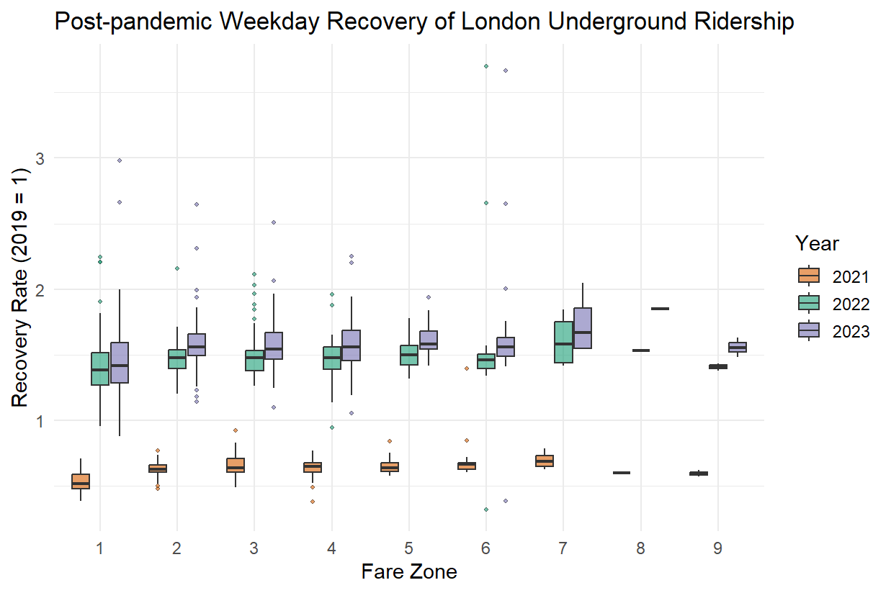

**Post-pandemic weekday recovery of London Underground ridership, 2021–2023** Boxplots show station-level recovery rates (2019 baseline = 1), grouped by fare zone. Recovery rate calculated as mean Tuesday–Thursday entries/exits per year divided by 2019 levels, to capture weekday commuting recovery patterns separately from annualised totals, highlighting differences across fare zones. Data source: TfL station entry/exit statistics.
:::

### 4.2.2 K-means

From the boxplots above (@fig-recannualbox and @fig-recweekdaybox), it is obvious that the values of recovery rate varied in a wide range, between 40% and 180%. Therefore, in K-means test, stations were categorised into 3 groups of different profiles. The first group represented overall low recovery, including stations that never returned to pre-pandemic levels and remained below baseline. The second group was the stations which experienced steady recovery of ridership over the years, including stations with medium recovery rate and nearly reached baseline level by the end of the study time period. The third group was formed by stations that exceeded pre-pandemic ridership by 2023, indicating over-recovery comparing with the baseline.

K-means of the annualised ridership recovery (@fig-ankmeans) showed that stagnant recovery stations concentrated in central London. Gradual recovery station is the most common type, appeared across the outer area of the city. Over recovery stations lowest proportion, and did not show significant pattern in distribution. The weekday outcome (@fig-wekmeans) followed similar condition. While some stations shifted between stagnant and gradual recovery profile, stations with over-recovered ridership remained majorly same between the two types of travel.

::: {#fig-ankmeans}
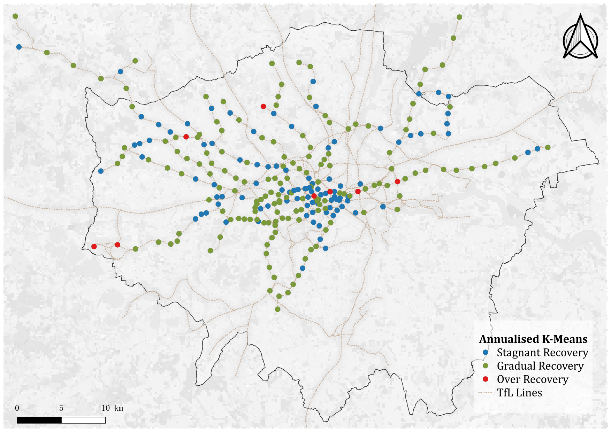

**K-means clustering of London Underground stations by annualised recovery profiles, 2021–2023** K-means clustering applied to station-level recovery rates in 2021, 2022, and 2023 (annualised, 2019 baseline = 1) to group stations with similar recovery trajectories. Data source: TfL station entry/exit statistics.
:::

::: {#fig-wekmeans}
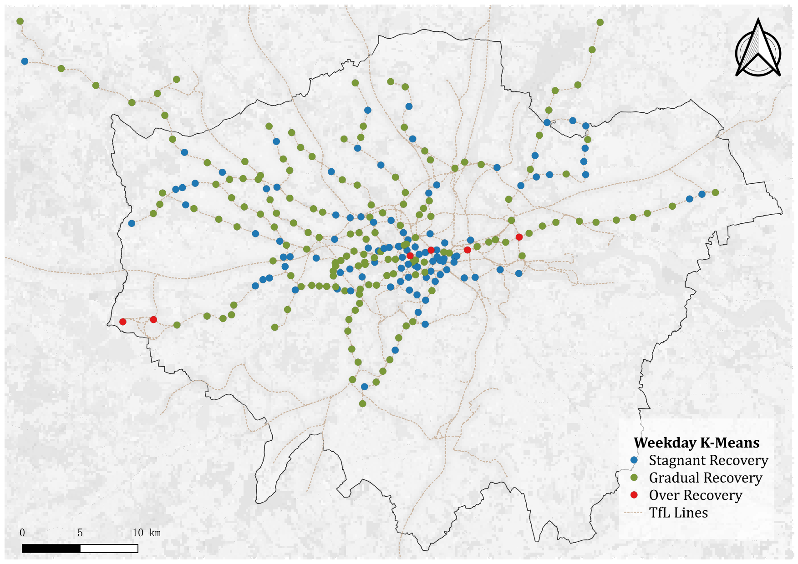 

**K-means clustering of London Underground stations by weekday recovery profiles, 2021–2023** K-means clustering applied to station-level weekday recovery rates in 2021, 2022, and 2023 (mean Tuesday–Thursday, 2019 baseline = 1) to group stations with similar weekday commuting recovery trajectories. Data source: TfL station entry/exit statistics.
:::

## 4.3 Spatial pattern of recovery rate: Global Moran’s I

Global Moran’s I results reveal a marked temporal shift in the spatial structure of recovery rates. 

In 2021, both annualised (@tbl-ankmeans) and weekday (@tbl-wekmeans) measures show strong positive autocorrelation, with Moran’s I values significantly greater than zero (p < 0.001) across all tested neighbour definitions (k = 3, 5, 8). This indicates that stations with similar recovery levels clustered together in the immediate aftermath of the pandemic. By contrast, results for 2022 and 2023 show Moran’s I values close to zero and statistically insignificant across all k values, suggesting that recovery rates became spatially random in later years. No system-wide clustering effects were detectable during this period.

The consistency of outcomes across multiple neighbour definitions confirms that the observed shift—from clustered recovery in 2021 to spatial randomness in 2022–2023—is robust and not dependent on the choice of spatial parameter.

| Year | k=3             | k=5             | k=8             | Interpretation                               |
| ---- | --------------- | --------------- | --------------- | -------------------------------------------- |
| 2021 | 0.354 (p<0.001) | 0.340 (p<0.001) | 0.310 (p<0.001) | Strong positive autocorrelation (clustering) |
| 2022 | –0.069 (ns)     | –0.017 (ns)     | 0.005 (ns)      | No spatial autocorrelation                   |
| 2023 | –0.088 (ns)     | –0.049 (ns)     | –0.022 (ns)     | No spatial autocorrelation                   |

: **Global Moran’s I statistics for annualised recovery rates across different neighbour definitions (k = 3, 5, 8), 2021–2023** Global Moran’s I calculated from station-level annualised recovery rates (2019 baseline = 1) using k-nearest neighbour spatial weights (row-standardised) to test for global spatial autocorrelation in recovery patterns. Data source: TfL station entry/exit statistics. {#tbl-ankmeans}

| Year | k=3             | k=5             | k=8             | Interpretation                               |
| ---- | --------------- | --------------- | --------------- | -------------------------------------------- |
| 2021 | 0.387 (p<0.001) | 0.361 (p<0.001) | 0.337 (p<0.001) | Strong positive autocorrelation (clustering) |
| 2022 | –0.034 (ns)     | 0.006 (ns)      | 0.025 (ns)      | No spatial autocorrelation                   |
| 2023 | –0.026 (ns)     | –0.009 (ns)     | 0.013 (ns)      | No spatial autocorrelation                   |

: **Global Moran’s I statistics for weekday recovery rates across different neighbour definitions (k = 3, 5, 8), 2021–2023** Global Moran’s I calculated from station-level weekday recovery rates (2019 baseline = 1, mean Tuesday–Thursday) using k-nearest neighbour spatial weights (row-standardised) to test for global spatial autocorrelation in weekday commuting recovery. Data source: TfL station entry/exit statistics. {#tbl-wekmeans}

## 4.4 Spatial pattern of recovery rate: Local Moran’s I

### 4.4.1 Annualised ridership clustering

The LISA results show that spatial clustering of annualised recovery rates is strongest in 2021, but weakens markedly in subsequent years, almost disappearing by 2023.

@fig-anlisa21 shows in 202, significant Low–Low clusters are concentrated in central London, where stations consistently under-recovered. At the same time, a smaller number of High–High clusters appear on some peripheral lines, indicating outer stations with relatively higher recovery compared to their neighbours.

@fig-anlisa22 shows by 2022, the clustering effect reduces substantially. Only a few clusters remain statistically significant, mostly at peripheral locations or isolated stations, while the majority of stations display no detectable spatial association.

@fig-anlisa23 shows in 2023, clustering almost disappears. Very few stations are identified as statistically significant, suggesting that annualised recovery rates had largely stabilised across the network and spatial variation in recovery was increasingly random.

::: {#fig-anlisa21}
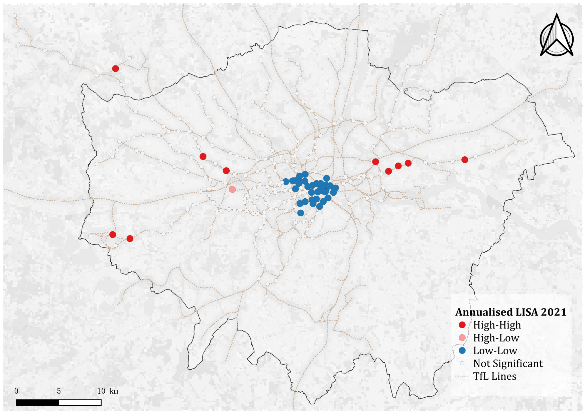

**Local Moran’s I cluster map of annualised recovery rates, 2021** Local Moran’s I (LISA) applied to station-level annualised recovery rates (2019 baseline = 1) using k-nearest neighbour spatial weights (row-standardised) to identify local clusters of high–high, low–low, and spatial outliers. Data source: TfL station entry/exit statistics.
:::

::: {#fig-anlisa22}
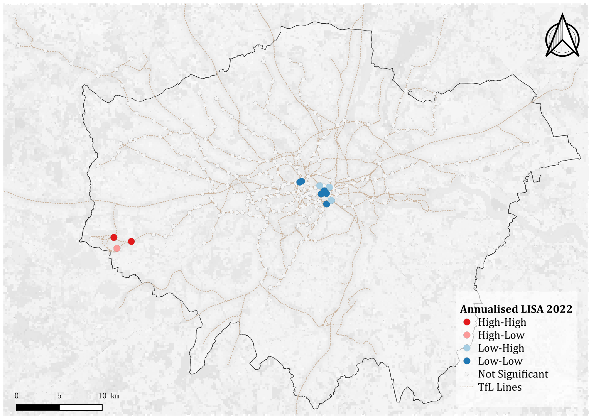

**Local Moran’s I cluster map of annualised recovery rates, 2022** Local Moran’s I (LISA) applied to station-level annualised recovery rates (2019 baseline = 1) using k-nearest neighbour spatial weights (row-standardised) to identify local clusters of high–high, low–low, and spatial outliers. Data source: TfL station entry/exit statistics.
:::

::: {#fig-anlisa23}
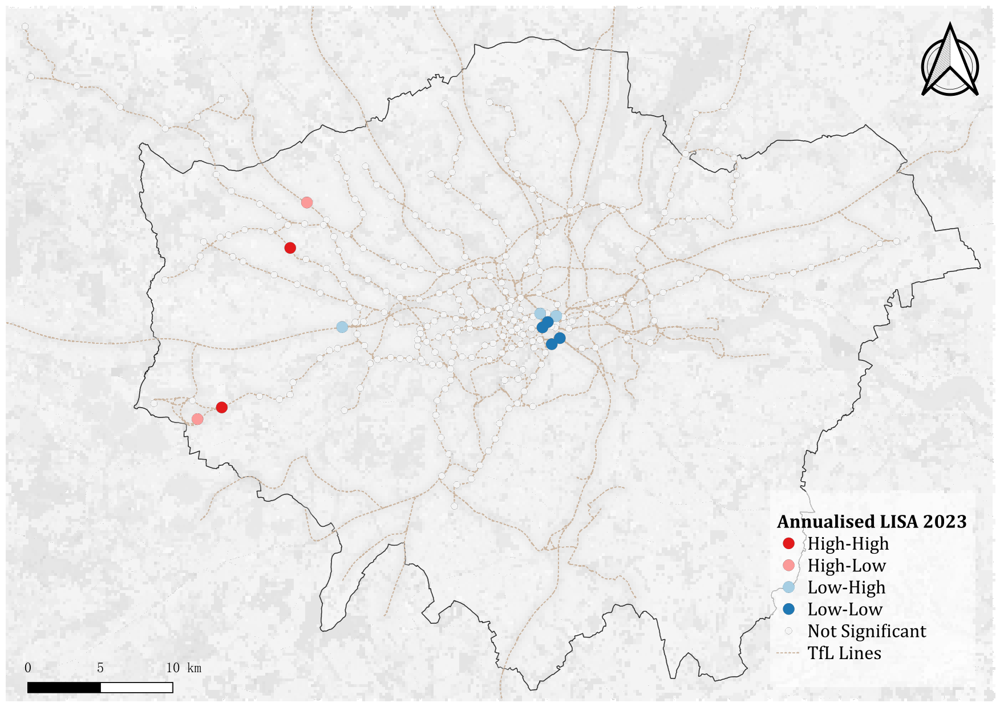

**Local Moran’s I cluster map of annualised recovery rates, 2023** Local Moran’s I (LISA) applied to station-level annualised recovery rates (2019 baseline = 1) using k-nearest neighbour spatial weights (row-standardised) to identify local clusters of high–high, low–low, and spatial outliers. Data source: TfL station entry/exit statistics.
:::

### 4.4.2 Weekday commuting ridership clustering

The LISA results for weekday commuting recovery mirror the annualised patterns above: clustering is strong in 2021, weakens in 2022, and largely disappears by 2023.

@fig-welisa21 shows in 2021, central London stations show clear low–low clustering, while some outer London areas exhibit high–high clustering. This indicates uneven recovery, with persistently weak commuter demand in the core and relatively stronger recovery at the periphery.

@fig-welisa22 shows in 2022, spatial clustering is much reduced. Only a few isolated high–high and low–low stations remain statistically significant, suggesting that weekday recovery patterns were becoming less spatially dependent.

@fig-welisa23 shows in 2023, clustering is almost entirely absent. Most stations display no significant association, reflecting a near-random distribution of weekday recovery intensity across the network.

::: {#fig-welisa21}
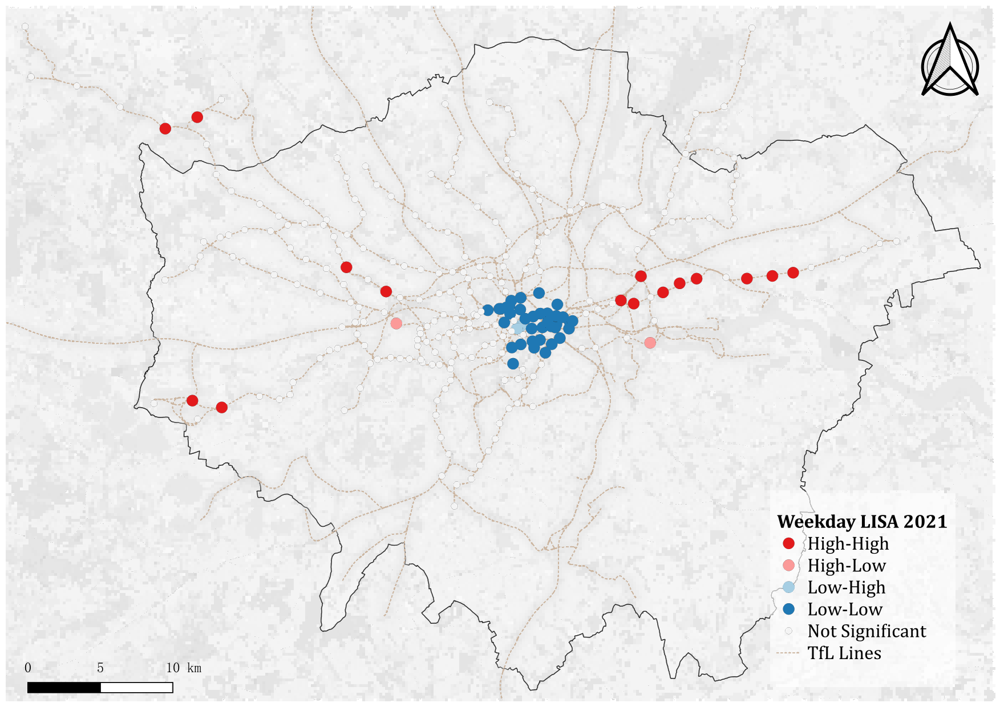

**Local Moran’s I cluster map of weekday recovery rates, 2021** Local Moran’s I (LISA) applied to station-level weekday recovery rates (2019 baseline = 1, mean Tuesday–Thursday) using k-nearest neighbour spatial weights (row-standardised) to identify local clusters of high–high, low–low, and spatial outliers. Data source: TfL station entry/exit statistics.
:::

::: {#fig-welisa22}
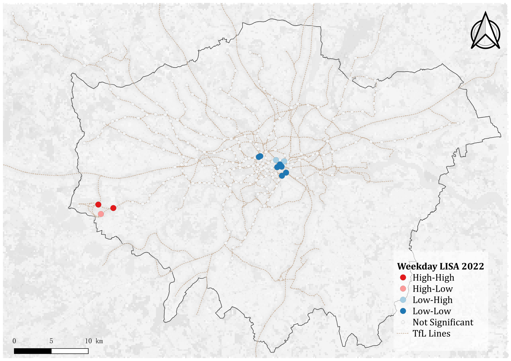

**Local Moran’s I cluster map of weekday recovery rates, 2022** Local Moran’s I (LISA) applied to station-level weekday recovery rates (2019 baseline = 1, mean Tuesday–Thursday) using k-nearest neighbour spatial weights (row-standardised) to identify local clusters of high–high, low–low, and spatial outliers. Data source: TfL station entry/exit statistics.
:::

::: {#fig-welisa23}
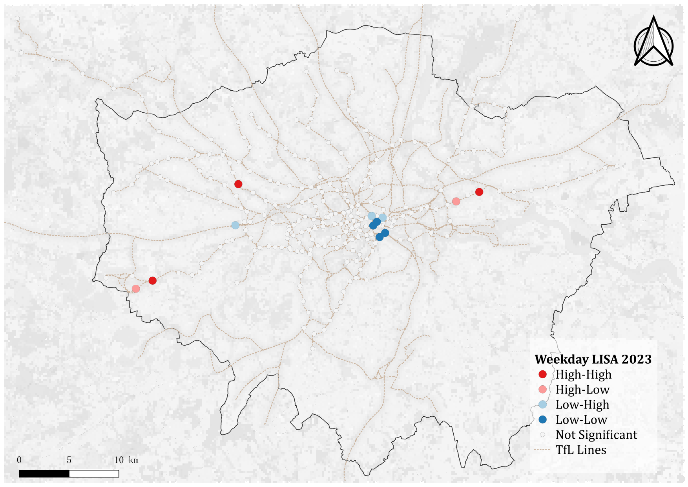

**Local Moran’s I cluster map of weekday recovery rates, 2023** Local Moran’s I (LISA) applied to station-level weekday recovery rates (2019 baseline = 1, mean Tuesday–Thursday) using k-nearest neighbour spatial weights (row-standardised) to identify local clusters of high–high, low–low, and spatial outliers. Data source: TfL station entry/exit statistics.
:::

## 4.5 Local Moran’s I sensitivity check

The LISA results in @fig-3 show a clear decline in spatial clustering of annualised recovery rates from 2021 to 2023, with patterns becoming progressively weaker and more spatially scattered, full size LISA maps of the annualised recovery are included in the Appendix.

In 2021, strong clustering is visible, particularly Low–Low clusters concentrated in central London. At the same time, several High–High clusters appear along outer corridors, most clearly on the eastern and western sections of the network. These patterns remain broadly consistent across both neighbour definitions, though the k = 8 specification identifies a wider spread of clusters compared to k = 3.

In 2022, the overall clustering weakens considerably. Only a small number of significant clusters are detected, mostly isolated Low–Low or High–High stations at the periphery. Differences between k = 3 and k = 8 are more pronounced here, with the larger k identifying slightly more central low–low stations.

By 2023, clustering effects have nearly disappeared. Both k = 3 and k = 8 show only scattered clusters, including a few high–high stations in west London and occasional Low–Low stations, but no concentrated areas of association. This indicates that annualised ridership recovery had largely stabilised by 2023, with spatial patterns giving way to randomness across the network.

::: {#fig-3}
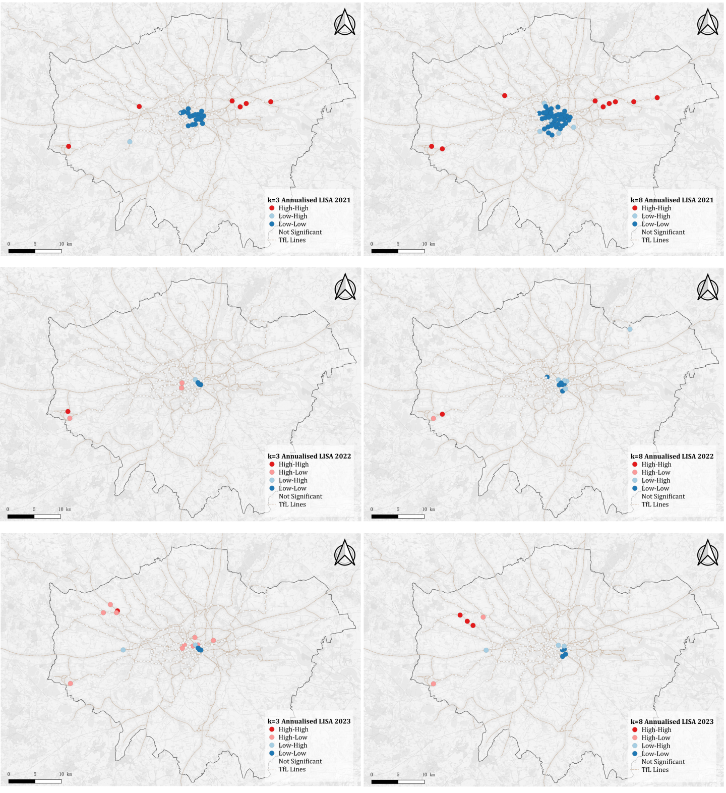

**Local Moran’s I cluster maps of annualised recovery rates, 2021–2023 (sensitivity test for neighbour definition)** Local Moran’s I (LISA) applied to station-level annualised recovery rates (2019 baseline = 1) using k-nearest neighbour spatial weights (row-standardised) with k = 3 and k = 8 to compare local clustering outcomes across alternative neighbour definitions. Data source: TfL station entry/exit statistics.
:::

In @fig-4, the weekday clustering results reveal a strong spatial pattern in 2021 that weakens substantially in subsequent years, broadly consistent with the annualised outcomes but showing some differences in the location and extent of clusters. full size LISA maps of the weekday commuting recovery are included in the Appendix.

In 2021, weekday recovery rates form distinct clusters, with pronounced low–low associations concentrated in central London. At the same time, multiple high–high clusters appear along outer corridors, particularly in the east, indicating areas of consistently higher weekday recovery. The use of k = 8 expands these clusters, capturing a broader stretch of peripheral high–high stations compared with the more localised k = 3 specification.

In 2022, clustering becomes considerably weaker. Only a few significant clusters remain, mainly in peripheral or isolated stations. The k = 8 definition highlights slightly more low–low clusters near the centre, but overall the spatial association is much reduced compared to 2021.

By 2023, the clustering patterns are minimal. Both k = 3 and k = 8 show only scattered high–high and low–low stations, with no concentration of clusters across the network. This suggests that weekday ridership recovery, like the annualised measure, had largely stabilised, with spatial variation giving way to randomness.

::: {#fig-4}
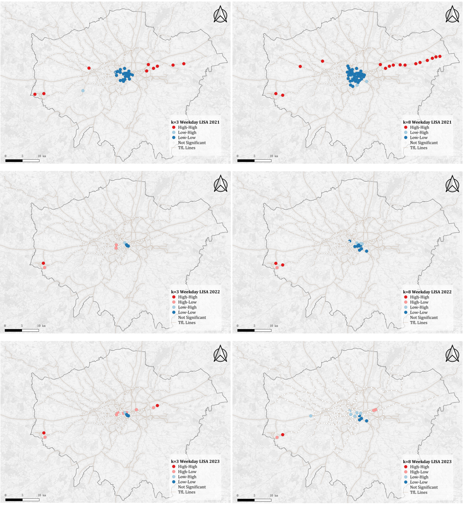

**Local Moran’s I cluster maps of weekday recovery rates, 2021–2023 (sensitivity test for neighbour definition)** Local Moran’s I (LISA) applied to station-level weekday recovery rates (2019 baseline = 1, mean Monday–Thursday) using k-nearest neighbour spatial weights (row-standardised) with k = 3 and k = 8 to compare local clustering outcomes across alternative neighbour definitions. Data source: TfL station entry/exit statistics.
:::

## 4.6 Getis-Ord $G_i^*$ statistics as supplement of Local Moran’s I

@fig-1 shows the trend of annualised recovery hot/cold spots indicated by $G_i^*$. In 2021, the $G_i^*$ analysis identifies strong clustering of recovery intensity, with hot spots concentrated in central and eastern London and cold spots in the west. This indicates a marked spatial differentiation in ridership recovery during the immediate aftermath of the pandemic. By 2022, this pattern weakens considerably. Only a few isolated hot spots remain in central and western areas, while most stations show no significant clustering, suggesting that spatial heterogeneity diminished after the initial rebound phase. In 2023, clustering is largely absent, with only scattered hot and cold spots detected. This suggests that recovery dynamics had evened out across the network, reinforcing the Global Moran’s I finding that spatial autocorrelation was no longer present.

@fig-2 shows the trend of weekday recovery hot/cold spots indicated by $G_i^*$. In 2021, the weekday $G_i^*$ map shows clear clusters of hot spots along several suburban lines and cold spots concentrated in central London, indicating a spatially uneven intensity of weekday recovery immediately after the pandemic. In 2022, the spatial clustering largely dissipates, with only a few marginal hot spots visible on the western edge of the network and faint cold spots in central London, suggesting a weakening of spatial dependence. In 2023, the pattern remains fragmented with isolated hot spots scattered across the periphery and only small cold spots in central areas, further supporting the observation that weekday recovery rates had stabilised and no longer exhibited significant spatial clustering.

The full size Getis-Ord $G_i^*$ maps of annualised (@fig-1) and weekday commuting (@fig-2) recovery hot spots and cold spots are included in the Appendix.

::: {#fig-1}
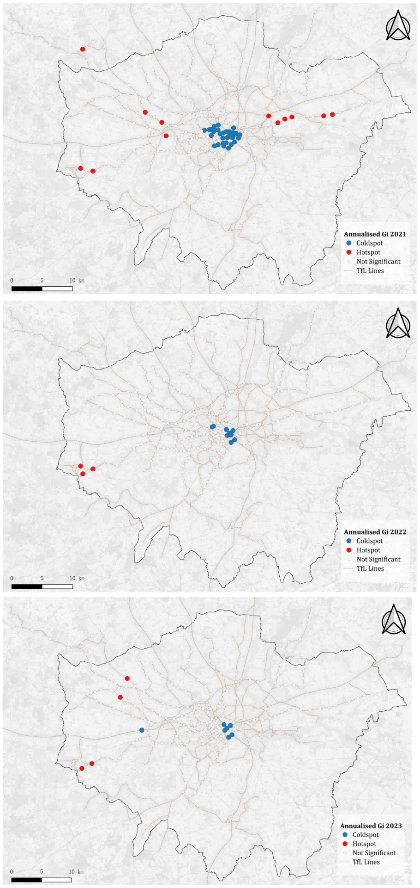

Local $G_i^*$ hot spot maps of annualised recovery rates, 2021–2023 Local Getis–Ord $G_i^*$ statistic applied to station-level annualised recovery rates (2019 baseline = 1) using k-nearest neighbour spatial weights (row-standardised) to identify significant hot spots and cold spots of recovery intensity across three post-pandemic years. Data source: TfL station entry/exit statistics.
:::

::: {#fig-2}
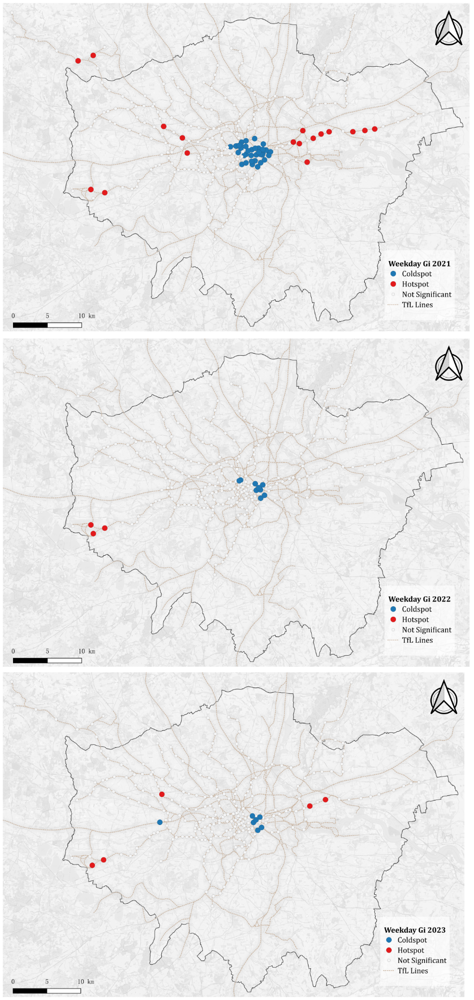

Local $G_i^*$ hot spot maps of weekday recovery rates, 2021–2023 Local Getis–Ord $G_i^*$ statistic applied to station-level weekday recovery rates (2019 baseline = 1, mean Monday–Thursday) using k-nearest neighbour spatial weights (row-standardised) to identify significant hot spots and cold spots of weekday recovery intensity across three post-pandemic years. Data source: TfL station entry/exit statistics.
:::

